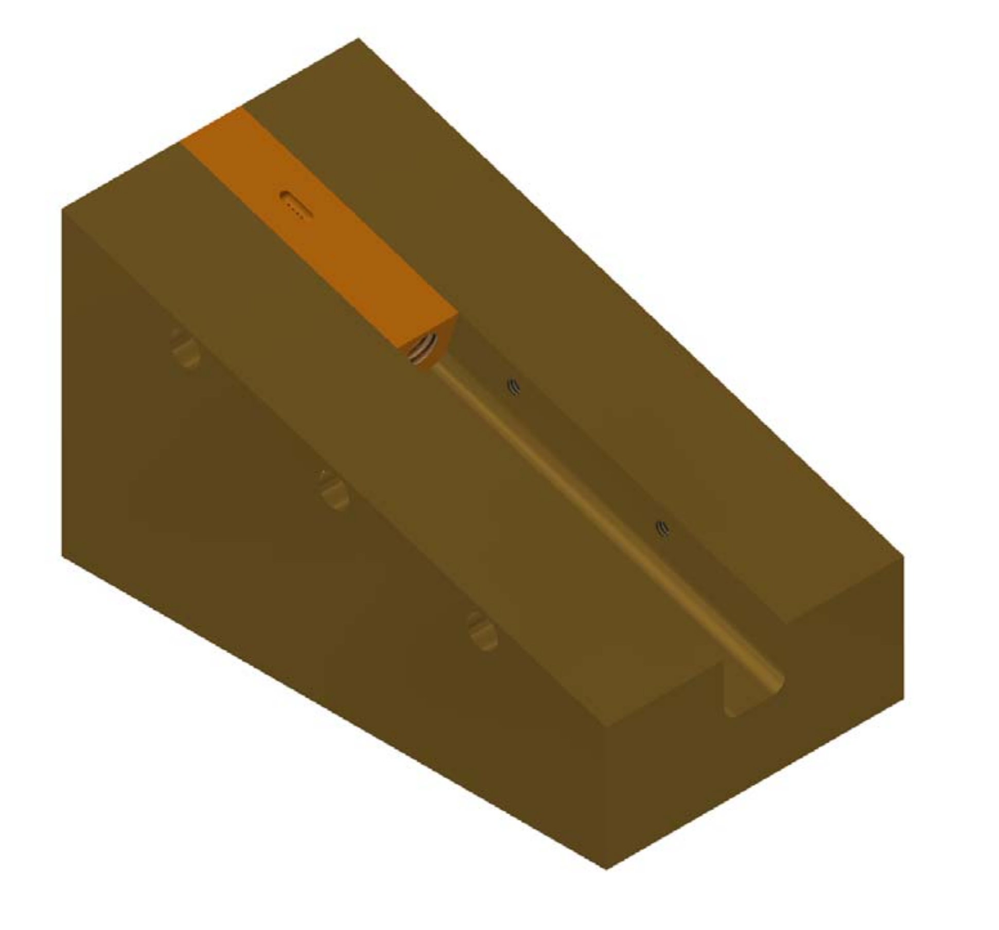

# Plate-Sarcophagus

Tethering flies to a thing rod requires some practice – and the right equipment. This procedure is typically done under a microscope and with good lighting.

## Machined Brass Sarcophagus

Flies are immobilized by low temperatures, for example by a cold metal plate under the microscope. The temperature of the metal plate is controlled by a peltier element and a temperature sensor. The heat produced by the peltier element is then transported off through a water cooling system with a bath circulator or chiller. 

During the tethering process, flies are held in place by a groove, or sarcophagus, in a small brass block. This small brass block is held in an angled position by a bigger metal body. The smaller block with the groove is machined separately to create different grooves for different applications and animals. The assembly of body and block with sarcophagus looks as follows and is described in the `Cooling_Plate-assembly.iam` file:

The bounding box of the body is about 3.8×7.0×3.2cm³ (width×height×depth). The files starting with `Cooling_Plate-body.*` contain the technical drawings and CAD files for this part.

The inner part is within a bounding box of 0.8×0.7×2.9cm³ (width×height×depth). The sarcophagus in the files `Cooling_Plate-inlay.*` have little holes on the bottom of the groove. These holes are connected to a bigger intake which can be used to create an underpressure below the animal. Purely for tethering, this is usually not necessary the shape of the sarcophagus is constraining the immobilized animal good enough. The additional fixation through vacuum is helpful if additional manipulations with higher precision are conducted.

## 3D printed sarcophagus

For a teaching course, we prototyped a 3D printed version of the sarcophagus to explore if it was possible to produce a considerably cheaper version that works good enough for behavioral experiments. As a cooling device we used the readily available [peltier mounted on a heatsink](https://www.adafruit.com/product/1335). Even in a warm environment of around 30°C the surface was cooled to below freezing. Our design of the [Sarcophagus platform](Sarcophagus_platform.stl) is small enough to go on top of this peltier element and still have space for a few immobilized flies as well as sarcophagus of different dimensions.

We printed this design on with different materials (including ABS and resins) and with different material densities. We then immobilized flies by placing their vials in a container of ice until they stopped moving and positiond individual flies in the different printouts. The flies in the low-density prints were the first ones able to climb out of their groove in less than two minutes.  Independent of the material, the flies in the high-density prints stayed in place considerably longer, up to 10 minutes. This gives enough time to tether a fly and we were able to use the 3D printed platforms for the teaching course.